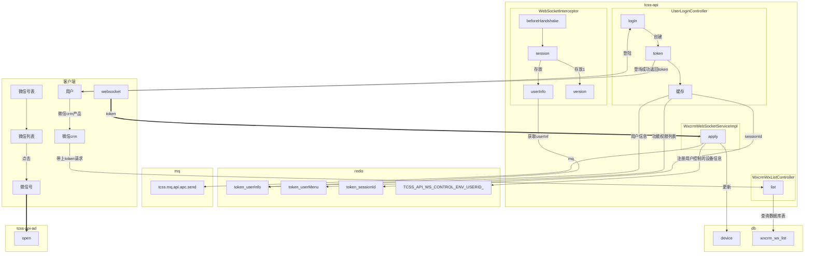

```mermaid
graph TB
    
    subgraph redis
     token_userInfo
     token_userMenu
     token_sessionId
     TCSS_API_WS_CONTROL_ENV_USERID_
    end
    
    subgraph mq
    tcss.mq.api.apc.send
    end
    subgraph db
    device
    wxcrm_wx_list
    end

    subgraph tcss-api
       subgraph UserLoginController
        login--创建-->token
        token-->缓存
        缓存--用户信息-->token_userInfo
        缓存--功能权限列表-->token_userMenu
        缓存--sessionId-->token_sessionId
       end
       
       subgraph WxcrmWxListController
       list--查询数据库表-->wxcrm_wx_list
       end
       
       subgraph WebSocketInterceptor
       beforeHandshake-->session
       session--存放-->userInfo
       userInfo--获取userInfo-->token_userInfo
       session--存放1-->version
       end
       
       subgraph WxcrmWebSocketServiceImpl
       apply--更新-->device
       apply--注册用户控制的设备信息-->TCSS_API_WS_CONTROL_ENV_USERID_
       apply--mq-->tcss.mq.api.apc.send
       end
    end
    
    subgraph tcss-api-ad
    open
    
    end

    subgraph 客户端
    用户--登陆-->login
    token--登场成功返回token-->用户
    用户--微信crm产品-->微信crm
    微信crm--带上token请求-->list
    微信号表-->微信列表
    websocket==token==>apply
    微信列表--点击-->微信号
    微信号==>open
    end
  
    
    
  
```